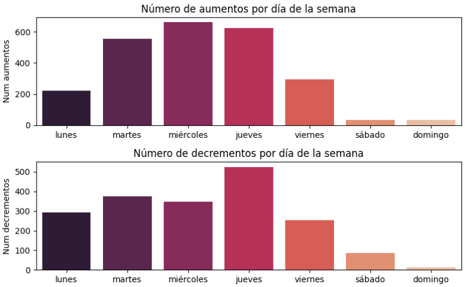

# Proyecto4-AnalisisFacua


Este proyecto está diseñado para recopilar, almacenar, analizar y visualizar datos de precios de productos en diferentes supermercados de España a partir de la web de FACUA. Una vez obtenidos los datos y almacenados en una base de datos se procederá al análisis de los mismos. Se busca comparar precios, observar que productos presentan mayores aumentos o caidas de precios, qué días suelen presentarse estas caídas y aumentos, cuáles son los productos más baratos en cada supermercado y otras consultas más de interés.


## Estructura del Proyecto

Este proyecto consta de cuatro etapas, cada una en un cuaderno de Jupyter que documenta su implementación:

1. **Scraping de Datos `(1-scrapeo.ipynb)`**: 

    - Extracción de datos de precios y productos desde la web de FACUA usando Selenium y Beautiful Soup.
    
    - Generación de archivos CSV estructurados que almacenan temporalmente los datos extraídos para su posterior procesamiento. Estos archivos se pueden encontrar dentro de la carpeta `datos`.

2. **Creación y Limpieza de Datos `(2-creacion_limpieza_df.ipynb)`**
    - Creación y limpieza de los DataFrames que contienen los precios de productos, eliminando duplicados, gestionando valores nulos y formateando los datos para facilitar su almacenamiento y análisis.

3. **Preparación de Tablas `(3-preparacion_tablas.ipynb)`**

    - Preparación de las tablas que serán insertadas en la base de datos, reestructuración y creación de las columnas necesarias para la inserción directa.

4. **Creación e inserciones en la base de datos + análisis `(4-consultas_bbdd.ipynb)`** 

    - Diseño de la base de datos en PostgreSQL para almacenar de manera eficiente la información recolectada.

    - Creación de tablas SQL que permiten estructurar la información en categorías clave: supermercados, tipo_productos, marcas y comparativas.

    - Análisis exploratorio y consultas SQL para extraer subconjuntos de datos de interés.

    - Generación de visualizaciones con Pandas y Matplotlib para comparar precios, estudiar su evolución temporal y detectar patrones y tendencias de precios.


## Resumen del proyecto

- **Scraping de Datos**:

    -   Extracción detallada de productos y precios de la web FACUA.
    -   Recopilación de datos para múltiples supermercados (Alcampo, Carrefour, Dia, Eroski, Hipercor y Mercadona).

-   **Almacenamiento en Base de Datos**:

    -   Creación de una base de datos relacional en PostgreSQL para almacenar toda la información recolectada.
    -   Población de la base de datos con los datos obtenidos de los archivos CSV.

-   **Análisis de Datos con Python y SQL**:

    -   Comparación de precios entre supermercados.
    -   Análisis de la evolución de precios en distintos periodos.
    -   Generación de gráficos que permitan visualizar las diferencias y tendencias de precios


## Conclusiones 

Lo primero que se hizo es obtener por supermercado y tipo de producto un precio promedio para cada tipo de producto. A continuación decisimos observar cuales eran los 10 productos con mayor variación de precio, los cuales eran sin duda alguna las garrafas de aceite de oliva de 5l. Lo que nos llevo a analizar las diferencias de precio de los productos pero para un litro. En cuanto al aceite de oliva la mayor variación era de 6 euros y correpondía  al marca Ferrarini, en cuanto al aceite de girasol la mayor difrencia de precios era de 1.33 de la marca coocol. En cuanto a la leche las direnecias no superaban los 80 céntimos estando en cabeza kaiku.

En cuanto a las marcas se planteo que podría ser interesante ver cuales son las que más incrementos han sufrido, diferenciandolas por tipo de producto. dichas gráficas y conclusiones se pueden consultar en el notebook `4-consultas_bbdd`.

Otra de las cuestiones relevantes a la hora de hacer el estudio era observar si había una tendencia en los días que había caidas o aumento en los precios de los productos, obteniendo la siguiente gráfica:



Como podemos observar el día en el cual se ha experimentado mayor subida de precios es el miércoles, seguido de cerca por el jueves y martes. En cuanto los días con más bajadas de precios son los jueves, seguido de martes y miércoles. Por lo tanto, en los mismo días son en los que más subidas y bajadas se registran. Si quisiera asegurarme de que no va a haber muchas subidas pero quizás alguna bajada iría al super un sábado.

Finalmente también se hizo un análisis por supermercado de cuales son los productos más baratos por cada tipo de supermercado, cuya tabla se puede consultar en el notebook. Llegando a la conclusión de que en cuanto a los aceites de girasol, los mas baratos suelen ser los de la propia marca de cada supermercado, a excepción del alcampo donde es koipesol, en el eroski coosol y en el hipercor abrisol. Respecto al aceite de oliva suele ser más barato el de orujo, excepto en el hipercor y mercadona donde las marcas más baratas son abril y el hacendado. En cuanto la leche, en alcampo sorprende con dos leches de marca como son president y kaiku a 50 centimos el litro, en el resto predominan las marcas propias de cada supermercado.

Para conluir el estudio también se puede consultar una compartiva de precios del día 1 de octubre respecto al día del estudio, el 25 de octubre y se puede observar cuales son los productos que mayor subida y bajada de precio ha experimentado, ¡échenle un ojo!


## Organización del Proyecto

El proyecto está organizado de la siguiente manera:

- **datos/**: Carpeta que contiene los archivos `.csv` de los datos extraídos de la web de Facua y las tablas ya limpias y listas para la inserción en la bbdd. Además de un `.json` con un diccionario de los links de cada producto analizado.

- **notebooks/**: Carpeta que contiene los archivos `.ipynb` sobre los cuales hemos trabajado los datos:
  - `1-scrapeo.ipynb`
  - `2-creacion_limpieza_df.ipynb`
  - `3-preparacion_tablas.ipynb`
  - `4-consultas_bbdd.ipynb`
    
    Estos archivos se deben revisar/ejecutar en orden para una completa comprensión del proyecto.

- **src/**: Carpeta que contiene un archivo `.py` en el cual tenemos funciones auxiliares a las cuales hacemos llamdas desde los notebooks.
  - `funciones_auxiliares.py`


## Instalación y Requisitos
Este proyecto usa Python 3.11 y requiere las siguientes bibliotecas:
- [numpy](https://numpy.org/doc/stable/)
- [pandas](https://pandas.pydata.org/docs/reference/frame.html)
- [matplotlib.pyplot](https://matplotlib.org/3.5.3/api/_as_gen/matplotlib.pyplot.html)
- [seaborn](https://seaborn.pydata.org/)
- [requests](https://requests.readthedocs.io/en/latest/)
- [BeautifulSoup](https://pypi.org/project/beautifulsoup4/)
- [Selenium](https://www.selenium.dev/documentation/)
- [psycopg2](https://pypi.org/project/psycopg2/)


Para visualizar el proyecto en tu máquina local, sigue estos pasos:

1. **Clona el repositorio**:
   ```bash
   git clone [URL del repositorio]

   Instala las dependencias en tu entorno de Python.
   
2. **Navega a la carpeta del proyecto**:
   ```bash
   cd Proyecto4-AnalisisFacua

2. **Ejecutar o visualizar los archivos**:
   Accede a la carpeta `notebooks` y ejecutar cada archivos en ordén. Además, configura una base de datos PostgreSQL y actualiza las credenciales en los notebooks.
